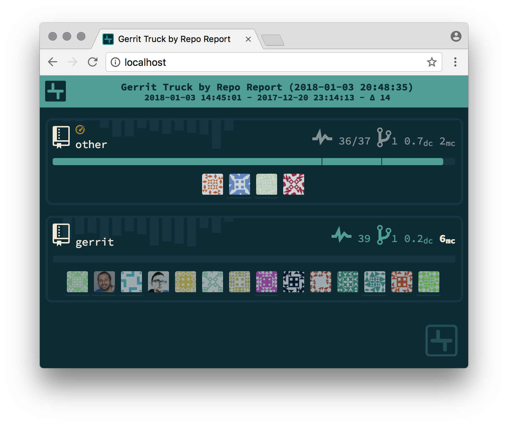

## gitReport

[](https://travis-ci.org/ThStock/gitReport)

Showes minimal stats based on review notes if present.


### Docker
#### Usage
```
$ mkdir myRepos
$ cd myRepos
$ git clone https://gerrit.googlesource.com/gerrit
$ cd gerrit
$ git config --add remote.origin.fetch +refs/notes/review:refs/notes/review
$ git config notes.displayRef refs/notes/review
$ git fetch
$ echo "main.gerrit.higlightPersonalExchange = true" > .git-report.conf
$ cd ..
$ docker run --name some-git-report -d -p80:80 -v $(pwd):/srv/src thstock/gitreport:latest
$ # open browser at http://localhost
```

#### Refs
* https://hub.docker.com/r/thstock/gitreport/
